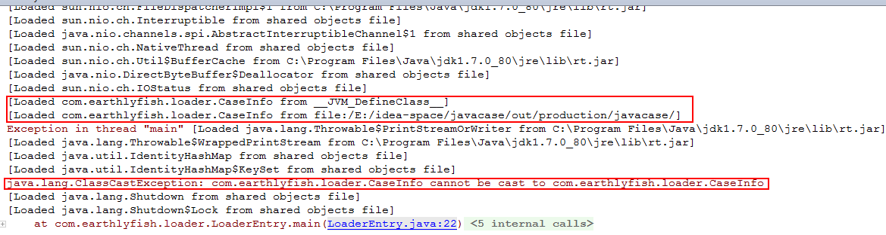
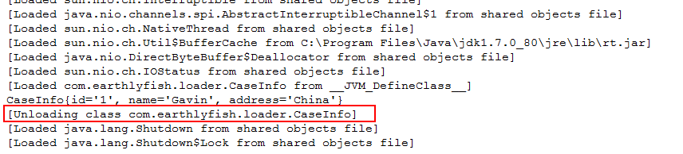
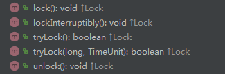
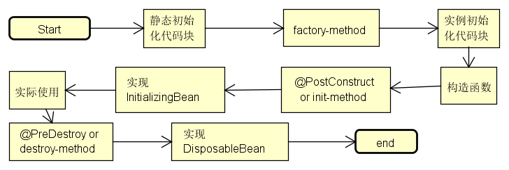

# ClassLoader
## 双亲委派模式
## 自定义类加载器问题
### Cast转换的问题
```java
 ClassLoader classLoader = new SelfClassloader();
 Class clazz = classLoader.loadClass("com.earthlyfish.loader.CaseInfo");
 CaseInfo lc = (CaseInfo) clazz.newInstance();   
```
上面的示例代码会报错，究其原因是因为：
*CaseInfo类是系统类加载器加载的，而该处clazz由自定义的加载器加载，所以会报下面的异常*
```java
Exception in thread "main" java.lang.ClassCastException:
      com.earthlyfish.loader.CaseInfo cannot be cast to com.earthlyfish.loader.CaseInfo
```
具体代码参考[LoaderEntry.java](./src/com/earthlyfish/loader/CaseInfo/LoaderEntry.java)

加`-verbose`参数打印了一下加载信息，如上所述：

### 关于类的卸载
**需要具备以下几个条件**
1. 该类的所有实例相关的对象都为null，即没有引用
2. 该类的所有实例都为空
3. 该类的class文件为空
4. 加载该类的类加载器实例为空

EX：
```java
        ClassLoader classLoader = new SelfClassloader();
        Class clazz = classLoader.loadClass("com.earthlyfish.loader.CaseInfo");

        //注意：此处不能通过cast强转的方式进行实例的转换
        //因为这里的CaseInfo类是系统类加载器加载的，而该处clazz由自定义的加载器加载
        //CaseInfo lc = (CaseInfo) clazz.newInstance();

        Object object=clazz.newInstance();

        //调用加载的类的实例的方法
        Method method=object.getClass().getMethod("setAllproperty",String.class,String.class,String.class);
        method.invoke(object,"1","Gavin",null);
        System.out.println(object);

        //以下测试类的卸载过程
        method=null;
        object=null;
        clazz=null;
        classLoader=null;
        System.gc();
```
其卸载过程如下：


**注意**

>如果加载的类重写了`finalize`方法，则有如下限制：
在回收不可达的对象时，jvm会优先判断该对象以前有没有调用过`finalize`方法，如果被调用过，则该次不会再调用，直接回收，
如果该实例的类没有重写`finalize`方法，则直接回收。
也就是说：不是说不可达的对象一定会被回收，重写`finalize`方法，将其引用指向类的引用或者其他可以让其再生，但是下次如果再不可达，
则难逃被回收的厄运了，当然，不建议我们重写`finalize`方法。

则需要第二次垃圾回收的时候才做卸载操作,如下:
```java
    @Override
    public void finalize() throws Throwable {
        super.finalize();
        System.out.println("回收我了");
    }
```
```java
        ClassLoader classLoader = new SelfClassloader();
        Class clazz = classLoader.loadClass("com.earthlyfish.loader.CaseInfo");

        //注意：此处不能通过cast强转的方式进行实例的转换
        //因为这里的CaseInfo类是系统类加载器加载的，而该处clazz由自定义的加载器加载
        //CaseInfo lc = (CaseInfo) clazz.newInstance();

        Object object=clazz.newInstance();

        //调用加载的类的实例的方法
        Method method=object.getClass().getMethod("setAllproperty",String.class,String.class,String.class);
        method.invoke(object,"1","Gavin",null);
        System.out.println(object);

        //以下测试类的卸载过程
        method=null;
        object=null;
        clazz=null;
        classLoader=null;
        System.gc();

        Thread.sleep(4000);
        //该次卸载生效
        System.gc();
```
# 多线程
## 基本特性
### 优先级
* 线程的优先级具有继承性，即A线程启动B线程，B的优先级和A的相同
* 线程的优先级与代码的执行顺序无关，高优先级的总是会优先执行，即CPU尽量将执行资源让给优先级较高的线程
## 线程终止解决之道
### `stop`方法(不建议使用)
`stop`方法可以停止线程，但由于存在诸如会造成死锁，数据不一致等情况，不建议使用．
### 通过标记
通过定义`volatile`变量来标记是否需要退出线程的执行.
```java
   public volatile boolean exitFlag = false;

   while (true) {
             if (exitFlag) {
                 System.out.println("我听到指令退出了");
                 return;
             }
             a++;
             b++;
         }
```
### 通过`Interrupt`
通过调用`Interrupt`方法来中断线程，在线程运行时，通过判断线程的中断状态来确定线程是否需要中断，并做一些后续的处理动作。
```java
　　　　try {
            while (true) {
                if (this.isInterrupted()) {
                    System.out.println("我被中断了，我要退出！");
                    throw new InterruptedException();
                }
                a++;
                b++;
            }
        } catch (InterruptedException e) {
            System.out.println("进入了中断处理处！");
            e.printStackTrace();
        }
```
中断后，尽量通过抛出`InterruptedException`的方式来处理，这样可以延续到上层，做一些各层需要做的处理.
## `synchronized`锁
* `synchronized`锁是可重入的，即自己可以再次获取自己的内部锁，因为不可重入锁的话，会导致死锁．
可重入锁也支持在父子类继承的环境中．
* 出现异常，锁自动释放
* 同步不具有继承性
* 同步整个方法是有弊端的，可以通过同步代码块的方式解决，即一半同步，一半异步
* 同步是采用的对象监视器的方式，同一对象同一时刻只能有一个线程访问
* 可以通过将JVM设置为`-server`模式提高线程运行的效率，则线程一直在私有堆栈中获取值

## `ReentrantLock`可重入锁
`ReentrantLock`可重入锁功能和`synchronized`类似，但它很灵活，能灵活的处理锁的获取和释放以及
在不同条件下对对象监视的`await/signal`.其提供的方法如下：



其中各方法如下：
1. `lock()`
    是阻塞式的获取锁，如果有中断操作，必须获取锁才能做中断处理
  
2. `lockInterruptibly()`
    能处理中断操作，改线程被中断后不需用获取锁
  
3. `tryLock()`
     试着获取锁，如果获取到，或者该线程本来已持有锁，则返回true，否则false
     
下面是利用`ReentrantLock`可重入锁实现的生产者消费者模式：
```java
     package com.earthlyfish.thread.lock;
     
     import java.util.concurrent.locks.Condition;
     import java.util.concurrent.locks.ReentrantLock;
     
     /**
      * Created by earthlyfisher on 2017/4/13.
      */
     public class CSByCondition {
     
     
         public static void main(String[] args) {
             final MiddleObject object = new MiddleObject();
     
             Thread thread = new Thread() {
                 @Override
                 public void run() {
                     for (int i = 0; i < 1000; i++) {
                         System.out.println(object.get());
                     }
                 }
             };
             thread.start();
     
             for (int i = 0; i < 1000; i++) {
                 object.put(i + "");
             }
         }
     }
     
     class MiddleObject {
         private int size = 1;
     
         private int count = 0;
     
         private int getIndex = 0;
     
         private int putIndex = 0;
     
         private final String[] items;
     
         private final ReentrantLock lock;
     
         private final Condition notEmpty;
     
         private final Condition notFull;
     
         public MiddleObject() {
             this.items = new String[size];
             lock = new ReentrantLock();
             notEmpty = lock.newCondition();
             notFull = lock.newCondition();
         }
     
         public void put(String elment) {
     
             try {
                 lock.lockInterruptibly();
                 while (count == size) {
                     notFull.await();
                 }
                 items[putIndex] = elment;
                 putIndex = ++putIndex == size ? 0 : putIndex;
                 count++;
                 notEmpty.signal();
             } catch (InterruptedException e) {
                 e.printStackTrace();
             } finally {
                 lock.unlock();
     
             }
         }
     
         public String get() {
             try {
                 lock.lockInterruptibly();
                 while (count == 0) {
                     notEmpty.await();
                 }
     
                 String element = items[getIndex];
                 items[getIndex] = null;
                 getIndex = ++getIndex == size ? 0 : getIndex;
                 count--;
     
                 notFull.signal();
     
                 return element;
             } catch (InterruptedException e) {
                 throw new RuntimeException();
             } finally {
                 lock.unlock();
             }
         }
     }

```
## 线程通信
### 等待通知机制
1. 通过wait/notity(notifyAll)的形式来实现
2. wait/notity(notifyAll)调用时，当前线程必须要获得该对象的对象级别锁，即只能在同步方法或方法块中调用，否则会抛出`IllegalMonitorStateException`
3. wait方法将当前线程置入预执行队列，即阻塞状态，并且在wait所在的代码行处停止执行，知道被唤醒或者被中断
4. 执行wait后，当前线程释放锁
5. 如果有多个wait线程，则由线程规划器选出一个线程被notity，并使它等待获取该对象的对象锁
6. notity调用后，知道将当前同步代码块执行完，被唤醒的wait线程才能获取当前的对象锁
7. notifyAll的作用是唤醒所有线程，至于那一个得到锁，则有优先级和分配策略所决定
8. wait(timeout)可以实现等待超时，自动唤醒
9. 可以通过pipedOutputStream／PipedInputStream实现线程的通信

##bean lifetime



##Regex
###环视断言

* 肯定环视：`(?=...)`,`(?<=...)`
* 否定环视：`(?!...)`,`(?<!...)`
两种环视的不同点：
1. 肯定环视要判断成功，字符串中必须有字符由环视结构中的表达式匹配
2. 否定环视要判断成功，有两种情况：
    * 字符串中出现了字符，但这些字符不能由环视结构中的表达式匹配
    * 字符串中不再有任何字符，即这个位置
    * 也就是说，这个位置是字符串的起始位置或者结束位置

先上例子：
将12345按英文格式输出，也就是三个三个分组，输出为12,345
正则匹配为：`(?<=\d)(?=(\d{3})+(?!\d)`
上面分为两部分：
1. `(?<=\d)`   表示字符传的左侧也是数字，如果不加的会在长度是３的整数倍的情况下显示为`,123,456`
2. `?=(\d{3})+`  表示有多个3个数字的组合
3. `(?!\d`   表示一直匹配，直到非数字字符出现

通过以下代码做输出：
```python
    print re.sub(r"(?<=\d)(?=(\d{3})+(?!\d)",r",","12345")
```

再来一个例子：
`(?=[-a-zA-Z0-9.]{0,255}(?![-a-zA-Z0-9.]))` ，匹配一个`-a-zA-Z0-9.`组成的长度在255内的字符串


